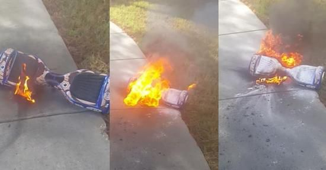

# 从 Segway 说起

Segway 是平衡车的发明者，也就是我们常说的平衡车老祖宗，Segway 本来是一家美国公司，在 2015 年时被小米生态链中 Ninebot 公司全资收购，成为了全新的 Segway-Ninebot 新公司。

相对于 Segway 以往的产品，大家对 Ninebot 推出的九号平衡车可能更熟悉一些 。它很简单，也很好玩，站上去如履平地，是一个合格的大玩具。

### 全世界第一辆能够自主平衡的人类运输工具

2001 年 12 月，Dean·Kamen 带着他引以为豪的 Segway 人类运输车（HT），现称为赛格威个人运输车（PT），在 Good Morning America 上亮相。[^1] 他彼时的心中一定有一个改变 60 亿人出行方式的梦想。尽管直到2018年年底，Segway-Ninebot 的用户才刚刚突破了一千万，按照现在服务 10 亿人的目标，也才堪堪达到 1% 的小目标。

▲ 图片来自：Wikimedia Commons [^2]

想改变世界，就要挑战现有的规则和习惯，而最终目的是让每个人都用上自家的产品。但 Segway 似乎从未打算这么做过，他们压根就没有没有把产品带到消费级市场，而是卖给一些特定的场合与职业。

你肯定不能把巡逻车说成是出行工具，它们只在有限的场合里绕着圈来来回回跑。但 Segway 一直深陷在此类桎梏中不能自拔。警用巡逻车、机场巡逻车、高尔夫球场巡逻车亦或是有钱人家的玩具，喊着改变世界的 Segway 却一直没有发现，他们的路和自己的口号早已是不同的两回事了。

▲ 图片来自：Wikimedia Commons [^3]

这种错位感也让人们的认知产生了混乱，就好像希望下载美图秀秀的手残党打开这个软件时变成了专业 PS 界面。平衡车这个产品到底定位在消费级还是专业级，连 Segway 自己也搞不清楚，而这点也直接反映到了 Segway 平衡车的销量上。

▲ 图片来自：GIT-SECURITY [^4]

2003 年，Segway 平衡车的销售业绩是 6000 辆，一直到 2009 年，Segway 对外宣布销售业绩才达到 5 万辆，而在被收购的前一年，2014 年 Segway 仅仅卖出了 1 万辆平衡车。更让人匪夷所思的是，这些卖往世界各地的平衡车，一但出了问题只能送回美国总部维修。

### 安全性是平衡车一直都没能解决的阿喀琉斯之踵

2015 年的时候，尽管北京已经开始禁止平衡车上路，但在中关村一带还是能在马路上时不时看到有人骑着平衡车在路上窜来窜去。那年也是平衡车安全事故频发的一年，出现意外事故受伤并不少见。

安全性是平衡车一直都没能解决的阿喀琉斯之踵，它们既无法归类在机动车里，也无法归类在非机动车中，但安全性却显著比两者都低，还有一定的操控难度。即便后来双轮平衡车降低了一定的操控门槛，但安全性方面却一直没有明显提高。

此外，平衡车当时由于昂贵的售价，除了政府采购之外，基本上只能作为有钱人的玩具，随之而来的名人效应却把平衡车糟糕的体验放大，2003 年美国前总统小布什曾经因躲避行人从 Segway 平衡车上摔下，类似这样的事件给 Segway 带来了不小的负面影响，三个月后 Segway 不得不召回了 6000 辆平衡车，因为在快没电的时候这些平衡车就会容易失去平衡。

2015 年，作为平衡车的衍生品——扭扭车在国际市场大受欢迎，几乎刷爆欧美街道，圣诞购物季的出货量更是“凶猛”，成为当年最火热的外贸爆品。但好景不长，由于电池爆炸事故频发和专利纠纷等问题，亚马逊曾一度对所有扭扭车进行下架处理，随后发出通告要求商家提供种种资质和认证才能重新上架。亚马逊下架扭扭车不仅仅是专利之争，更多的是道路交通和行驶安全问题，因为美国历来对生产、销售假冒伪劣商品处罚力度极大。从 12 月初的英国扣留 1.5 万多辆不合格的扭扭车，到美国最近发生的超过 10 起扭扭车起火事件，时速最高达 26 公里/每小时引发交通安全担忧，扭扭车在国外频现安全问题。美国三大航空公司不久前宣布将禁止携带或托运电动扭扭车。 

2016 年 9 月，北京上海等各地交管部门明令禁止平衡车上路。

### 从代步工具到酷玩智能

今后路怎么走？在 Segway 被 Ninebot 收购之后，雷军曾经一针见血的指出了平衡车发展方向的问题。

继续 Segway 改变短途出行的路是没有未来的。尤其是在中国，解决「最后一公里」的出行问题早已经落在了当时在红海厮杀性起的共享单车们身上，Segway-Ninebot 只能另想出路，跟着雷军的思路去做玩具，似乎已经是最好的路线。

之后 Segway-Ninebot 的产品越做越轻量化和趣味化，从九号平衡车到米家滑板车，再到最近的分离式平衡轮，从出行工具一路减负到年轻人玩具，价格也由当初的 6000 美元一路降到 1999 元人民币。

▲ 图片来自：GIT-SECURITY [^5]

摆脱了重任之后，Segway-Ninebot 的创造力也被激发了出来，从 2001 年开始就几乎没有改变过的平衡车产品，首次出现了分离式平衡轮和卡丁车改装套件这样的产品。当年没做好实用性导致平衡车无法成为一个生产力工具，而如今「酷」已经取而代之，从拿来用到拿来玩，并不是只有一字之差，是两个品类和两种观念的迭代。

改变了观念做玩具的 Segway-Ninebot 就会成功吗？虽然无法下这样的断言，但相比过去来说，Segway-Ninebot 要远远比 Segway 认清自己是谁，也更加懂得如何去取悦用户了。

虽然改变人类出行方式的梦想已经无法实现，但现在的 Segway-Ninebot 离「让每个人拥有自家产品」的愿望却稍微近了一些。

___

> [^1]: 图片来自 [Wikimedia Commons](http://www.segway.com.ph/our-story.html) 

> [^2]: 图片来自 [Wikimedia Commons](http://suo.im/4xhIQ2)

> [^3]: 图片来自 [Wikimedia Commons](http://suo.im/4Mk9iW)

> [^4]: 图片来自 [GIT-SECURITY](https://www.git-security.com/topstories/management/segway-inc-gliding-safely-provide-safety)

> [^5]: 图片来自 [fortune](http://fortune.com/2018/06/29/segway-motorized-e-skates/)

### 参考

> [把平衡车做成玩具之后， Segway 离梦想又近了一点 - ifanr.com](https://www.ifanr.com/1073762)