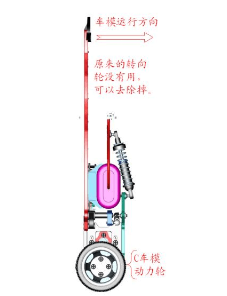

# 智能汽车竞赛助推技术普及

全国大学生“恩智浦杯”智能汽车竞赛，前身为“全国大学生‘飞思卡尔杯’智能汽车竞赛”，起源于韩国，最初是韩国汉阳大学汽车控制实验室在飞思卡尔半导体公司资助下举办的以 HCS12 单片机为核心的大学生课外科技竞赛。引入国内后，参赛选手须使用竞赛秘书处统一指定的竞赛车模套件，采用恩智浦半导体（飞思卡尔半导体）公司的 8 位/ 16 位/ 32 位微控制器作为核心控制单元，自主构思控制方案进行系统设计，制作一个能够自主识别路径的智能车，在专门设计的跑道上自动识别道路行驶，最快跑完全程而没有冲出跑道并且技术报告评分较高为获胜者。其设计内容涵盖了控制、模式识别、传感技术、汽车电子、电气、计算机、机械、能源等多个学科的知识，对学生的知识融合和实践动手能力的培养，具有良好的推动作用。2017 年，恩智浦（NXP）以约 118 亿美元并购飞思卡尔（Freescale），此后智能汽车竞赛由“飞思卡尔杯”改名为“恩智浦杯”。

2011 年，当时举行的是第七届全国大学生“飞思卡尔杯”智能汽车竞赛。智能汽车竞赛组委会将电磁组比赛规定为车模直立行走，其他两个组别（光电组、摄像头组）的车模行走方式保持不变。车模直立行走比赛是要求仿照两轮自平衡电动车的行进模式，让车模以两个后轮驱动进行直立行走。在电磁组比赛中，利用了原来 C 型车模双后轮驱动的特点，实现两轮自平衡行走。相对于传统的四轮行走的车模竞赛模式，车模直立行走在车体检测、控制算法等方面提出了更高的要求。

为了能够帮助参赛同学尽快制作车模参加比赛，2011 年 12 月 22 日，竞赛秘书处编写了《第七届全国大学生“飞思卡尔”杯智能汽车竞赛电磁组直立行车参考设计方案（版本 1.0）》。参赛队员可以在此基础上，进一步改进硬件和软件方案，提高竞赛水平。

当时，竞赛秘书处主任卓晴教授（清华大学）经常在论坛中与参赛队员进行交流，为他们解答设计方案中的问题。论坛中有些参赛队员将《电磁组直立行车参考设计方案》简称为《清华方案》，久而久之，该简称也在网络上流传开来。

智能汽车竞赛将电磁组比赛规定为车模直立行走，并编写出行之有效《电磁组直立行车参考设计方案》，激发了高校学生参与比赛的兴趣，首次在高校竞赛层面普及了直立行车的相关知识和技术。

