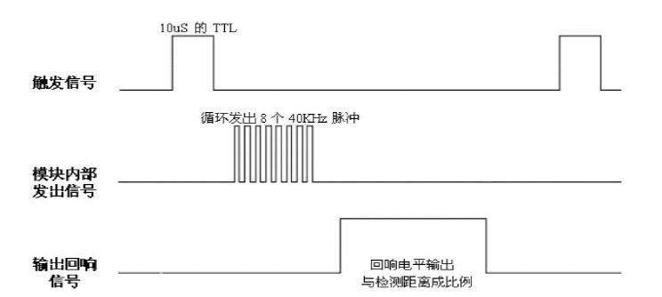

# 驱动超声波传感器

HC-SR04 是一款常见的用于单片机应用的超声波测距模块。超声波发射器向某一方向发射超声波，在发射的同时开始计时，超声波在空气中传播，途中碰到障碍物就立即返回来，超声波接收器收到反射波就立即停止计时。声波在空气中的传播速度为 340m/s，根据计时器记录的时间 t，就可以计算出发射点距障碍物的距离 s，即：$$ s=340m/s*t/2 $$。这就是时间差测距法。HC-SR04 超声波测距模块测量距离：2cm~450cm（理论值）。

### 工作原理

> 1. 采用 IO 口 TRIG 触发测距，给至少 10us 的高电平信号; 

> 2. 模块自动发送 8 个 40KHz 的方波，自动检测是否有信号返回； 

> 3. 有信号返回，通过 IO 口 ECHO 输出一个高电平，高电平持续的时间就是超声波从发射到返回的时间。测试距离=(高电平时间*声速)/2;   （注：超声波在空气中速度为 340m/s）

看文字不是很直观，简单粗暴来看超声波时序图。

以上时序图表明，你只需要提供一个 10us 以上脉冲触发信号，该模块内部将发出 8 个 40KHz 周期电平并检测回波。一旦检测到有回波信号输出回响信号。回响信号脉冲宽度与所测的距离成正比。由此通过发射信号到收到的回响信号时间间隔可以计算得到距离。公式：us/58=厘米 或者 us/148=英寸；或者 距离=高电平时间*声速（340M/S）/2。建议测量周期为 60ms 以上，以防止发射信号对回响信号的影响。

### 使用思路

初始化时，将 TRIG 和 ECHO 端口都置低，首先向给 TRIG 发送至少10us 的高电平脉冲（模块自动向外发送 8 个 40KHz 的方波），然后等待，捕捉 ECHO 端输出上升沿，捕捉到上升沿的同时，打开定时器开始计时，再次等待捕捉 ECHO 的下降沿，当捕捉到下降沿，读出计时器的时间，这就是超声波在空气中运行的时间，按照公式：测试距离=(高电平时间*声速)/2，就可以算出超声波到障碍物的距离。

### 注意事项

1. 此模块不宜带电连接。如果要带电连接，则先让模块的 GND 端先连接，否则会影响
   模块工作。
2. 测距时，被测物体的面积不少于 0.5 平方米且要尽量平整，否则会影响测试结果。  

### 具体步骤

使用 STM32CubeMX 配置 PA2 为输出，PA11 为下拉输入。PA2 连接 TRIG  引脚，PA11 连接 ECHO 引脚。