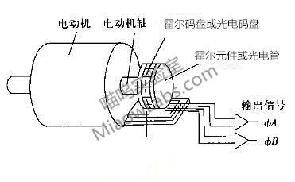

# 编码器使用教程与测速原理

> 我们将通过这篇教程与大家一起学习编码器的原理，并介绍一些使用的技术，例如四倍频技术原理和使用。

### （一）编码器概述

编码器是一种将角位移或者角速度转换成一连串电数字脉冲的旋转式传感器，我们可以通过编码器测量到位移或速度信息。编码器从输出数据类型上分，可以分为增量式编码器和绝对式编码器。

从编码器检测原理上分，还可以分为光学式、磁式、感应式、电容式。常见的是光电编码器（光学式）和霍尔编码器（磁式）。

### （二）编码器原理

光电编码器是一种通过光电转换将输出轴上的机械几何位移量转换成脉冲或数字量的传感器。光电编码器是由光码盘和光电检测装置组成。光码盘是在一定直径的圆板上等分地开通若干个长方形孔。由于光电码盘与电动机同轴，电动机旋转时，检测装置检测输出若干脉冲信号，为判断转向，一般输出两组存在一定相位差的方波信号。

霍尔编码器是一种通过磁电转换将输出轴上的机械几何位移量转换成脉冲或数字量的传感器。霍尔编码器是由霍尔码盘和霍尔元件组成。霍尔码盘是在一定直径的圆板上等分地布置有不同的磁极。霍尔码盘与电动机同轴，电动机旋转时，霍尔元件检测输出若干脉冲信号，为判断转向，一般输出两组存在一定相位差的方便信号。

可以看到两种原理的编码器目的都是为了获取AB相输出的方波信号，其使用方法也一样，下面是一个简单的示意图。

### （三）编码器接线说明

具体到我们的编码器电机，我们可以看看电机编码器的实物。

这是一款增量式霍尔编码器。编码器有AB相输出，所以不仅可以测速，还可以辨别转向。根据上图的接线说明可以看到，我们只需给编码器电源5V供电，在电机转动的时候即可以通过AB相输出方波信号。编码器自带了上拉电阻，所以无需外部上拉，可以直接连接到单片机IO引脚读取。

### （四）编码器软件四倍频技术

下面我们说一下编码器倍频的原理。为了提高大家下面学习的兴趣，我们先明确，这是一项非常实用的技术，可以真正地把编码器的精度提升四倍。

OK，先看看下面编码器输出的波形图。

这里，我们是通过软件的方式实现四倍频。首先，可以看到上图编码器输出的AB相波形。正常情况下我们使用M法测速的时候，会通过测量单位时间内A相输出的脉冲数来得到速度信息。常规的方法，我们只测量A相（或B相）的上升沿或下降沿，也就是上图中对应的数字1234中的某一个，这样就只能计数3次。而四倍频的方法是测量A相和B相方波的上升沿和下降沿。这样在同样的时间内，可以计数12次（3个1234的循环）。这就是软件四倍频的原理。

### （五）单片机如何采集编码器数据

因为编码器输出的是标准的方波，所以我们可以使用单片机（STM32、51、Arduino等）直接读取。在软件中的处理方式是分两种，自带编码器接口的单片机如STM32，可以直接使用硬件计数。而没有编码器接口的单片机如51单片机，可以通过外部中断读取，比如把编码器A相输出接到单片机的外部中断输入口，这样就可以通过跳变沿出发中断，然后在对应的外部中断服务函数里面，通过B相的电平来确定正反转。如当A相来一个跳变沿的时候，如果B相是高电平就认为是正转，低电平就认为是反转。
